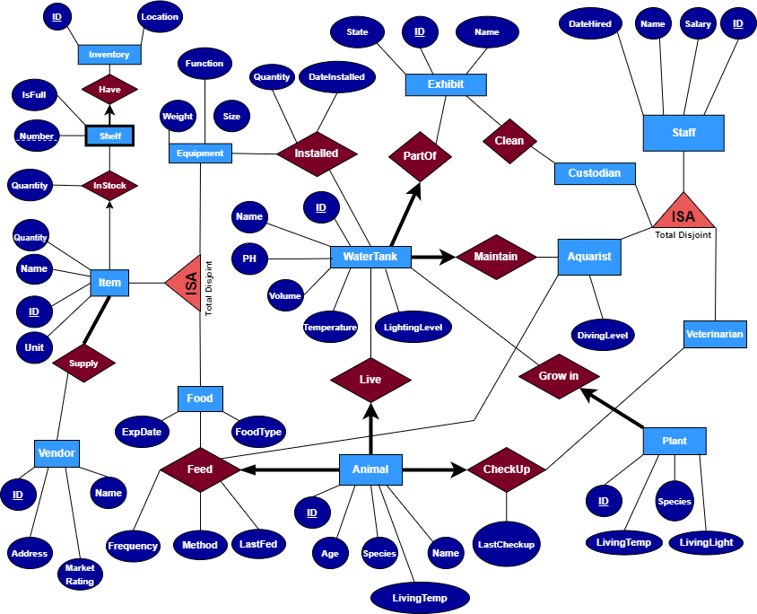

# Aquarium Management Database Project -SQLJavaSwingGUI

## Summary of the project:
Our database management project is designed to comprehensively model the many aspects of an aquarium
exhibition, capturing both its internal and external components. Our database models core
entities of an aquarium which are water tanks, devices within the tanks/maintenance
equipment, marine animals, aquatic plants, the supply chain of curated animal diet, and the
individuals responsible for operations and maintenance. Our project aims to address and
represent the intricacies of the aquarium domain, and as an example of a real-life situation, the
database can be applied to efficiently manage large-scale.

## Short description of the final project and what it accomplished:
Our final project allows users to interact with a user-friendly GUI application that enables the 
query operations listed on the criteria. It immediately updates the Oracle Database when 
changes are made by the user on the GUI application. With a combination of various panels, 
buttons and selection options for various operations our final project is a robust implementation 
of an Aquarium Management system that holds the potential for real-world applications in 
professional settings.

## ER Diagram of the Relational Database:

## Contributors:  
Sharon Marfatia  
Ayan Qadir  
Chris Jung
